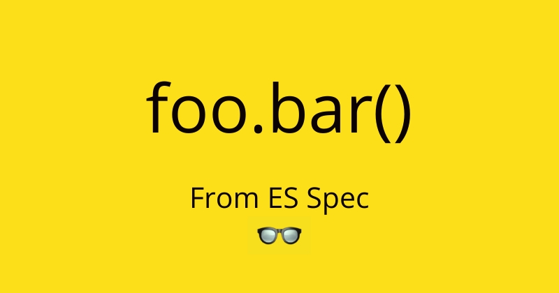

Title - What is `this` inside foo.bar()? 

Tags - #JavaScript, #ecmascript, #ecma, #tc39

Cover image - 

Series - [Bits of Ecmascript Spec](https://hashnode.com/series/bits-of-ecmascript-spec-ck7y31jpp02m7zns16f82tv81)

Question - Can or should i cross-post this to my own publication bendtherules.hashnode.dev ??